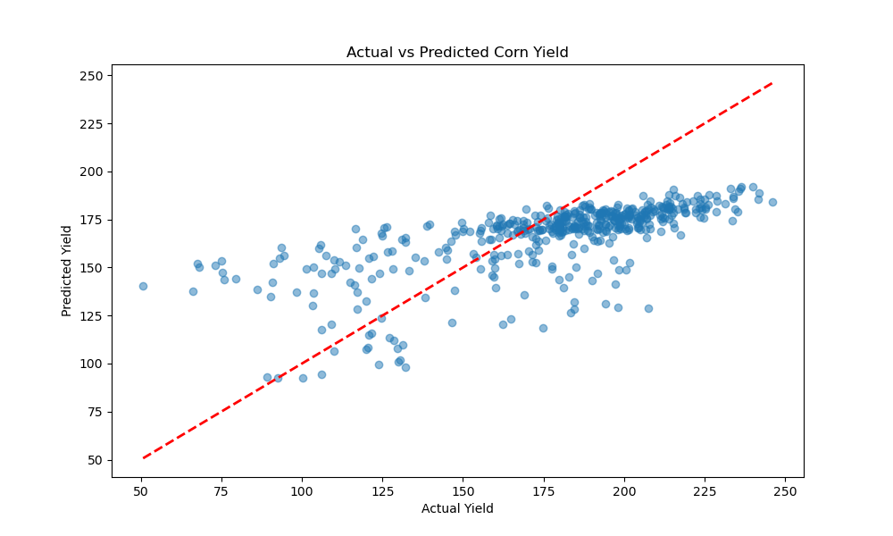

# Environmental Sensing and Crop Yield Modeling



## 📌 Project Overview
This project leverages historical weather patterns and soil composition data to predict **Crop Yields** (specifically Corn) across the US Corn Belt. By analyzing 30+ years of environmental data (1980–2018), we developed a **Random Forest Regressor** to estimate agricultural output at the county level.

The goal is to provide data-driven insights for agricultural planning, utilizing machine learning to understand the relationship between environmental sensing data and food production.

## 🚀 Features
*   **Data Pipeline**: Automated ingestion and cleaning of over 25,000 records.
*   **Feature Engineering**: Processing 300+ weekly weather variables (`W_x_y`) and soil measurements.
*   **Predictive Modeling**: Random Forest Regressor achieving **MAE: 24.5 Bu/Acre**.
*   **Professional Architecture**: Modular code structure, configuration management (`config.yaml`), and automated testing.

## 📂 Project Structure
```text
├── config/              # Centralized configuration (paths, params)
├── data/                # Raw and Processed datasets
├── docs/                # Detailed Documentation & Reports
├── results/             # Model artifacts and Visualization plots
├── src/                 # Source code (preprocessing, training, EDA)
├── tests/               # Automated Unit Tests
├── Makefile             # Command automation
└── README.md            # You are here
```

## 📖 Documentation
*   **[Technical Guide](docs/PROJECT_DETAILS.md)**: Deep dive into the codebase and data flow.
*   **[Final Report](docs/FINAL_REPORT.md)**: Formal analysis of the model's performance.
*   **[Data Dictionary](docs/DATA_DICTIONARY.md)**: Schema definition for the dataset.
*   **[Visual Walkthrough](docs/walkthrough.md)**: Graphical summary of results.

## 🛠️ Quick Start

### Prerequisites
*   Python 3.8+
*   `pip`

### Installation
1.  Clone the repository:
    ```bash
    git clone https://github.com/yourusername/crop-yield-modeling.git
    cd crop-yield-modeling
    ```
2.  Install dependencies:
    ```bash
    make setup
    # Or: pip install -r requirements.txt
    ```

### Usage
1.  **Run Tests**:
    ```bash
    make test
    ```
2.  **Train Model**:
    ```bash
    make train
    ```
3.  **View Results**: Check the `results/` directory for plots and the saved model.

